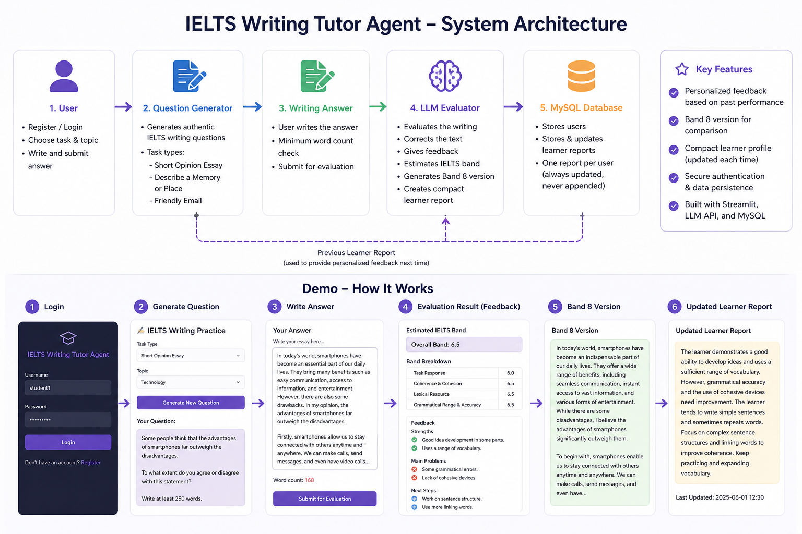

# IELTS Writing Tutor Agent

An LLM-based personalized IELTS Writing Tutor built with **Streamlit**, **MySQL**, and an **OpenAI-compatible API**.

This project helps IELTS learners practice writing by generating writing prompts, evaluating user responses, estimating IELTS writing band scores, correcting mistakes, producing Band 8-level sample answers, and maintaining a compact learner profile for personalized future feedback.



---

## Overview

IELTS learners often receive generic feedback that does not track their long-term weaknesses. This project aims to solve that problem by building a personalized writing practice system.

The system does not simply evaluate one essay at a time. Instead, it maintains a compact learner report for each user. After every writing submission, the previous report is updated and replaced with a new summarized version. This makes the system more personalized while keeping API usage and database storage efficient.

---

## Key Features

- **User Authentication**
  - Register and login system
  - Each user has a separate learner profile

- **AI-Powered Writing Question Generation**
  - Generates writing prompts based on selected task type and topic
  - Supports different writing practice formats such as opinion essays, memory/place descriptions, and friendly emails

- **Writing Evaluation**
  - Corrects the learner's writing
  - Estimates an IELTS writing band score
  - Provides feedback on strengths, weaknesses, and next steps
  - Shows error examples with explanations

- **Band 8 Version**
  - Generates a high-quality Band 8 version of the learner's answer
  - Helps learners compare their own writing with a stronger model answer

- **Persistent Learner Modeling**
  - Stores a compact writing report for each user
  - Updates the report after each writing attempt
  - Avoids appending long histories to reduce token usage and API cost

- **MySQL Database Integration**
  - Stores users and learner reports
  - Maintains one report row per user

---

## System Workflow

```text
User Login / Registration
        ↓
Select Writing Task and Topic
        ↓
Generate Writing Question
        ↓
User Writes an Answer
        ↓
Load Previous Learner Report
        ↓
LLM-Based Writing Evaluation
        ↓
Feedback + Band Estimate + Band 8 Version
        ↓
Generate Updated Learner Report
        ↓
Save Report in MySQL Database
